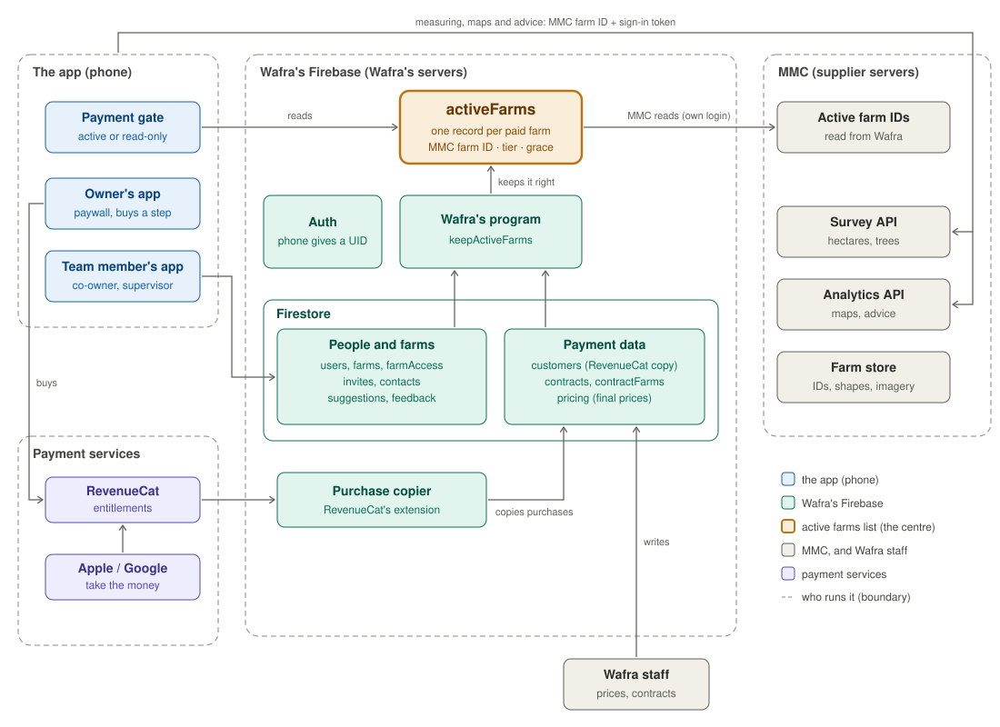

# Service architecture

*How the Wafra Farm App's services fit together: accounts, farms, payment, and the link to MMC. Audience:
Wafra, MMC, and whoever builds the app. Status: draft. Nothing here is built yet, so nothing here needs to
stay compatible with anything.*



## 1. The idea in six lines

1. **Wafra holds all client data**: people, phone numbers, owners, roles, farms, purchases, contracts. All in
   Wafra's Firebase.
2. **MMC holds the farms**: farm IDs, shapes, imagery, surveys and analytics. Names, phone numbers and
   owners stay with Wafra, so MMC can focus on the farms. MMC reads one list from Wafra's database, and that
   is all it needs.
3. **That list is `activeFarms`**: one record per farm that is paid for. It is the centre of everything.
4. **Wafra's Cloud Functions keep the list right**, from purchases, contracts, prices and farm sizes. They
   run by themselves, even when nobody opens the app.
5. **The app reads the list** to decide if a farm is active or read-only. **MMC reads the list** to decide
   which farms to analyse, and bills Wafra only for those (and for the surveys Wafra asks for).
6. **Wafra sets every price.** The app and MMC use Wafra's prices and do not decide any.

## 2. Who runs what

| Boundary | Runs | Holds |
|---|---|---|
| **The app** (the phone) | screens, paywall, the payment gate (reads `activeFarms`), calls to MMC's analytics | nothing of its own beyond a cache |
| **Wafra's Firebase** (Wafra's servers) | Auth, Firestore, Cloud Functions, RevenueCat's extension | every piece of client data, and `activeFarms` |
| **Payment services** | RevenueCat, Apple, Google | purchases and receipts |
| **MMC** (technology supplier's servers) | surveys, analytics, advice engine | farm IDs, shapes, imagery, results |
| **Wafra staff** | the Firebase console or an admin page; the accounting tool | prices, contracts, invoices |

## 3. The active farms list

`activeFarms/{farmId}`: one record per paid farm. It holds only what MMC needs:

```
{ mmcFarmId, tier: "advanced" | "professional", since, graceUntil }
```

- A farm is **on the list** while it is paid for: by a purchase (including the 30-day trial), by a contract,
  or during the 14 days of grace when the paid step no longer covers the owner's farms.
- A farm **comes off the list** as soon as it is not paid for. The app then shows it read-only, and MMC stops
  analysing it.
- **Only Wafra's Cloud Functions write it.** The app and MMC read it. This keeps one source of truth.
- **MMC reads it with its own login**, which can read this list and nothing else. It is all MMC needs.

How the functions decide is in [`CLOUD_FUNCTIONS.md`](CLOUD_FUNCTIONS.md).

## 4. The documents

| Document | What it covers |
|---|---|
| [`DEVELOPER_GUIDE.md`](DEVELOPER_GUIDE.md) | **start here if you build the app**: what is ready, local emulators, what each screen reads and writes, RevenueCat |
| [`PRICING_AND_PAYMENT.md`](PRICING_AND_PAYMENT.md) | who pays where, bands, price steps, store products, the paywall, the payment gate |
| [`ACCOUNTS_AND_ROLES.md`](ACCOUNTS_AND_ROLES.md) | accounts, roles, contracts, invitations, the flows and the edge cases |
| [`FIREBASE.md`](FIREBASE.md) | Wafra's Firebase projects, what they hold, who writes, deploying the rules, keys |
| [`FIRESTORE_SCHEMA.md`](FIRESTORE_SCHEMA.md) | every Firestore collection and field, and who writes it |
| [`CLOUD_FUNCTIONS.md`](CLOUD_FUNCTIONS.md) | the four functions: what starts them, what they read, what they write |
| [`MMC_INTERFACE.md`](MMC_INTERFACE.md) | what MMC holds, what it reads, what it is asked to do, how it bills |
| [`architecture.svg`](architecture.svg) | the diagram above |
| `private/` | Wafra's own price sheet, kept outside the repository (it is in `.gitignore`). |

The Firestore rules and indexes themselves are in [`firebase/`](firebase/), with the Firebase CLI config.
